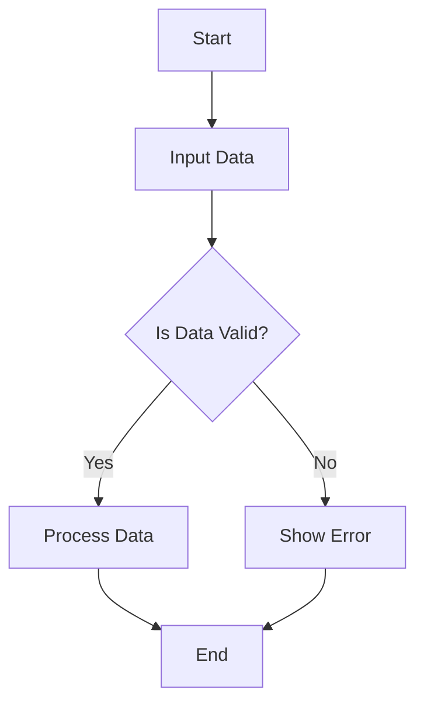

# C++ Runtime for Parallelism & Concurrency
A specification for high performance computing applications enabling implementation to have following traits:

- High throughput
- Resposiveness
- Data Parallel Computation
- Task Parallelism
- Potentially Event Based Co-ordination**
- Pipelining

## Software Components

#### OS Level Thread Control Library

- This will be the lowest layer in the entire stack of software
- Will be used to spawn threads, enable/disable hyperthreading, controll thread to core mapping, potentially control thread local memory allocation using NUMA concepts

#### Abstraction for TCL (Thread Control Library)

- This will expose user friendly APIs to spawn the threads with custom configurations

#### Thread & Data Management Layer

- It will store all running threads
- Will control their eager/lazy execution
- Will handle the work queue for each thread
- Will expose APIs to submit work and access state of execution

#### Data Partition Schemes

- Will allow users to specify the way data is split
- chunk size, number of chunks

#### Partition Scheduling Schemes

- How each chunk/partition is mapped to each underlying OS level thread

## Use Cases

1. Parallel Software Pipeline
2. SPMD & Loop Parallelism Computations
3. Task Parallelism for Network or GUI applications

## Questions

1. Where does task come into the picture
2. What is the differ or similarity bw partition and chunk
3. Define a standard naming system
4. Will this framework only for for Data Parallel Computational purposes?
5. Can this system be used to expose a user friendly API to define software level pipelines?
6. Can this system be used to for task parallelism e.g., one task/thread runs a logging system, 2nd thread runs the socket recieve logic, 3rd thread runs the transmit logic and 4-8th thread run processing pipeline?

## Technology Options

- Thread Control Library:

    1. hwloc: to fetch CPU, hardware thread and NUMA properties of underlying hardware. Also allow thread pinning, numa allocation etc.
    2. numactl

